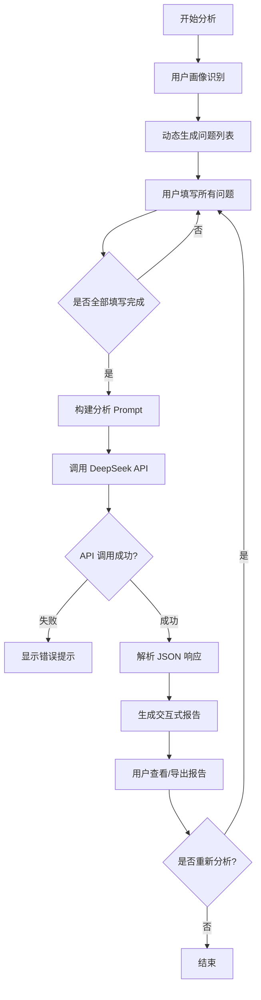
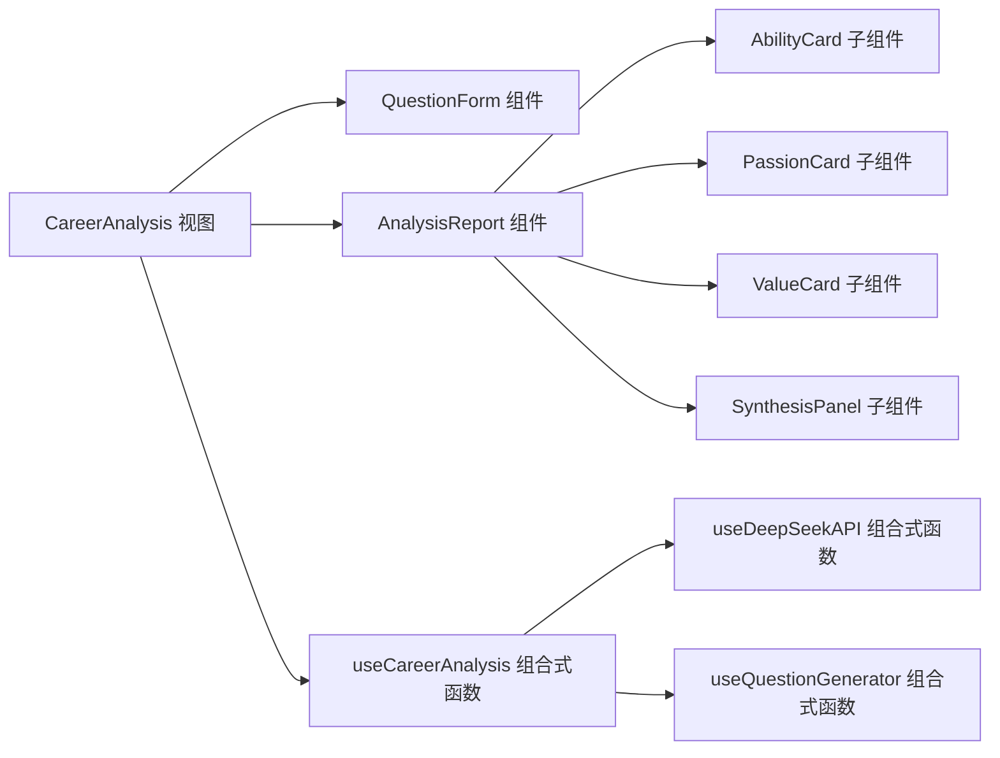
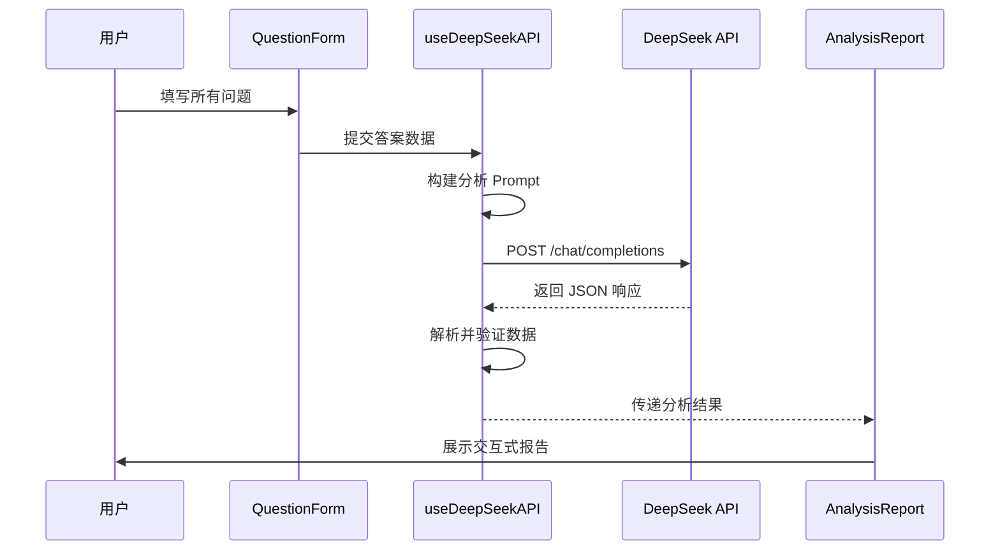
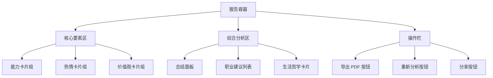

# 生涯规划分析功能设计文档

## 1. 功能概述

### 1.1 核心目标

构建一个基于 AI 的生涯规划分析工具，通过深度分析用户回答，提取"能力、热情、价值观"三大核心要素，并生成个性化的职业发展建议。

### 1.2 核心特性

- 根据用户画像动态生成个性化问题
- 调用 DeepSeek API 进行深度心理分析
- 前端临时处理，不持久化敏感数据
- 交互式可视化报告展示

## 2. 业务流程

### 2.1 整体流程



### 2.2 用户画像识别逻辑

根据以下维度识别用户画像，用于动态生成问题：

| 维度     | 识别依据             | 影响的问题类型                                       |
| -------- | -------------------- | ---------------------------------------------------- |
| 职业阶段 | 学生/应届/在职/转型  | 侧重点不同（学生侧重潜能挖掘，在职侧重职业转型）     |
| 行业背景 | 技术/商业/创意/服务  | 问题场景化（技术类问题偏向解决问题，创意类偏向表达） |
| 年龄段   | 18-25/26-35/36+      | 问题深度和价值观权重                                 |
| 困惑类型 | 迷茫型/选择型/发展型 | 问题侧重点（迷茫型多问兴趣，选择型多问取舍）         |

### 2.3 动态问题生成策略

**基础问题池**（必答，6-8 题）：

- 能力维度：描述一次你轻松解决复杂问题的经历
- 热情维度：周末不用工作时，你最想做什么？
- 价值观维度：什么事情会让你感到愤怒或不公？

**扩展问题池**（根据画像选择，3-5 题）：

- 学生画像：你最享受的学习时刻是什么？
- 在职画像：如果不考虑收入，你会选择什么工作？
- 转型画像：是什么让你想要改变现状？

## 3. 技术架构设计

### 3.1 前端架构



### 3.2 核心模块职责

| 模块                 | 职责               | 输入          | 输出           |
| -------------------- | ------------------ | ------------- | -------------- |
| QuestionForm         | 问题展示与答案收集 | 问题列表      | 用户答案对象   |
| useQuestionGenerator | 动态生成问题       | 用户画像      | 个性化问题列表 |
| useDeepSeekAPI       | API 调用封装       | Prompt 字符串 | 分析结果 JSON  |
| AnalysisReport       | 交互式报告渲染     | 分析结果      | 可视化界面     |
| useCareerAnalysis    | 状态管理与流程编排 | -             | 分析状态/方法  |

## 4. 数据结构设计

### 4.1 用户画像类型

| 字段          | 类型   | 说明     | 示例                                              |
| ------------- | ------ | -------- | ------------------------------------------------- |
| careerStage   | string | 职业阶段 | 'student' \| 'fresh' \| 'working' \| 'transition' |
| industry      | string | 行业背景 | 'tech' \| 'business' \| 'creative' \| 'service'   |
| ageGroup      | string | 年龄段   | '18-25' \| '26-35' \| '36+'                       |
| confusionType | string | 困惑类型 | 'lost' \| 'choice' \| 'development'               |

### 4.2 问题对象结构

| 字段        | 类型    | 说明                              |
| ----------- | ------- | --------------------------------- |
| id          | string  | 问题唯一标识                      |
| category    | string  | 问题类别（ability/passion/value） |
| text        | string  | 问题文本                          |
| placeholder | string  | 输入提示                          |
| required    | boolean | 是否必填                          |
| minLength   | number  | 最小字数要求                      |

### 4.3 用户答案结构

```
{
  [questionId: string]: {
    text: string        // 用户回答文本
    wordCount: number   // 字数统计
    timestamp: number   // 回答时间戳
  }
}
```

### 4.4 分析结果结构（API 返回）

```
{
  profile: {
    abilities: [
      {
        tag: string           // 能力关键词
        analysis: string      // 深度分析文本
      }
    ],
    passions: [
      {
        tag: string           // 热情关键词
        analysis: string      // 深度分析文本
      }
    ],
    values: [
      {
        tag: string           // 价值观关键词
        analysis: string      // 深度分析文本
      }
    ]
  },
  synthesis: {
    summary: string                 // 综合总结
    career_suggestions: string[]    // 职业建议列表
    life_advice: string             // 生活哲学建议
  }
}
```

## 5. DeepSeek API 集成设计

### 5.1 API 调用流程



### 5.2 Prompt 工程设计

**System Prompt（系统提示词）**：

```
你是一位拥有 20 年经验的资深生涯规划师和心理侧写师。
你擅长透过用户的文字描述，分析出他们深层的心理结构。
请严格按照 JSON 格式输出，不要包含任何 Markdown 标记。
```

**User Prompt 构建逻辑**：

- 包含完整的分析框架（能力/热情/价值观的判断标准）
- 动态插入用户的 Q&A 列表
- 明确输出格式要求（JSON Schema）

### 5.3 API 配置参数

| 参数            | 值            | 说明                   |
| --------------- | ------------- | ---------------------- |
| model           | deepseek-chat | 使用 DeepSeek 聊天模型 |
| temperature     | 0.7           | 平衡创造性与一致性     |
| max_tokens      | 2000          | 限制响应长度           |
| response_format | json_object   | 强制 JSON 输出         |

### 5.4 错误处理策略

| 错误类型      | 处理方式                 | 用户提示                               |
| ------------- | ------------------------ | -------------------------------------- |
| 网络错误      | 重试 3 次（指数退避）    | "网络连接失败，正在重试..."            |
| API 限流      | 等待后重试               | "服务繁忙，请稍候..."                  |
| JSON 解析失败 | 降级处理（提取部分内容） | "分析结果格式异常，已尽力提取可用信息" |
| 超时          | 取消请求                 | "分析超时，请简化回答后重试"           |
| API Key 无效  | 不重试                   | "服务配置错误，请联系管理员"           |

## 6. 交互式报告设计

### 6.1 报告布局结构



### 6.2 交互功能设计

| 功能         | 交互方式               | 实现目标       |
| ------------ | ---------------------- | -------------- |
| 标签展开     | 点击卡片展开详细分析   | 渐进式信息披露 |
| 雷达图可视化 | 鼠标悬停显示数值       | 直观对比各维度 |
| 高亮关键词   | 分析文本中的关键词高亮 | 快速抓住要点   |
| 复制分享     | 一键复制报告文本       | 方便分享       |
| PDF 导出     | 生成带样式的 PDF       | 长期保存       |

### 6.3 可视化设计

**雷达图**（使用 ECharts）：

- 维度：能力强度、热情强度、价值观清晰度
- 数据来源：根据分析文本长度和关键词密度计算得分（0-100）
- 交互：点击维度跳转到对应卡片

**时间轴动画**：

- 报告渲染时，卡片依次淡入（使用 @formkit/auto-animate）
- 延迟：每个卡片间隔 150ms

## 7. 状态管理设计

### 7.1 useCareerAnalysis 状态

| 状态           | 类型    | 初始值    | 说明                                           |
| -------------- | ------- | --------- | ---------------------------------------------- |
| currentStep    | string  | 'profile' | 当前步骤（profile/questions/analyzing/report） |
| userProfile    | object  | null      | 用户画像                                       |
| questions      | array   | []        | 动态生成的问题列表                             |
| answers        | object  | {}        | 用户答案映射                                   |
| analysisResult | object  | null      | AI 分析结果                                    |
| isLoading      | boolean | false     | API 调用中                                     |
| error          | string  | null      | 错误信息                                       |

### 7.2 方法定义

| 方法              | 参数                    | 返回值  | 职责                   |
| ----------------- | ----------------------- | ------- | ---------------------- |
| setUserProfile    | profile: UserProfile    | void    | 设置用户画像并生成问题 |
| updateAnswer      | questionId, text        | void    | 更新单个答案           |
| submitForAnalysis | -                       | Promise | 提交分析请求           |
| resetAnalysis     | -                       | void    | 重置所有状态           |
| exportReport      | format: 'pdf' \| 'text' | Promise | 导出报告               |

## 8. 组件设计规范

### 8.1 QuestionForm 组件

**输入属性**：

- questions: 问题列表数组
- modelValue: 答案对象（v-model）

**输出事件**：

- update:modelValue: 答案变更
- submit: 提交所有答案

**内部逻辑**：

- 实时字数统计
- 必填项验证（最少 30 字）
- 自动保存到 LocalStorage（防止误关闭）

### 8.2 AnalysisReport 组件

**输入属性**：

- result: 分析结果对象
- loading: 加载状态

**子组件**：

- AbilityCard: 展示单个能力标签
- PassionCard: 展示单个热情标签
- ValueCard: 展示单个价值观标签
- SynthesisPanel: 综合分析面板

**交互行为**：

- 卡片展开/收起动画
- 关键词高亮（使用正则匹配）
- 复制功能（使用 Clipboard API）

## 9. 性能优化策略

### 9.1 前端优化

| 策略         | 实现方式                                 | 预期效果         |
| ------------ | ---------------------------------------- | ---------------- |
| 组件懒加载   | AnalysisReport 使用 defineAsyncComponent | 减少初始加载体积 |
| 答案本地缓存 | LocalStorage 存储（带过期时间）          | 防止数据丢失     |
| API 请求去重 | 使用 @tanstack/vue-query 缓存            | 避免重复调用     |
| 虚拟滚动     | 问题列表超过 15 题时启用                 | 优化长列表渲染   |

### 9.2 API 调用优化

| 策略     | 实现方式                    | 预期效果         |
| -------- | --------------------------- | ---------------- |
| 请求防抖 | 提交按钮 2 秒内只能点击一次 | 防止重复请求     |
| 超时控制 | 设置 30 秒超时              | 避免长时间等待   |
| 流式响应 | 如果 API 支持，使用 SSE     | 实时展示分析进度 |

## 10. 安全与隐私设计

### 10.1 数据安全

| 措施             | 实现方式                     | 防护目标       |
| ---------------- | ---------------------------- | -------------- |
| 不持久化敏感数据 | 仅内存存储，页面刷新清除     | 防止数据泄露   |
| API Key 保护     | 存储在环境变量，不暴露给前端 | 防止滥用       |
| HTTPS 传输       | 强制使用 HTTPS               | 防止中间人攻击 |
| 输入过滤         | 过滤 XSS 攻击字符            | 防止注入攻击   |

### 10.2 用户隐私

| 原则       | 实现方式                           |
| ---------- | ---------------------------------- |
| 数据最小化 | 只收集分析必需的信息               |
| 用户控制   | 提供"清除数据"按钮                 |
| 透明度     | 显示隐私说明（数据不存储、不分享） |

## 11. 用户体验设计

### 11.1 加载状态设计

| 阶段       | 视觉反馈   | 文案提示                     |
| ---------- | ---------- | ---------------------------- |
| 问题生成中 | 骨架屏     | "正在为您定制问题..."        |
| 分析中     | 进度条动画 | "AI 正在深度分析您的回答..." |
| 解析结果   | 旋转加载器 | "正在生成报告..."            |

### 11.2 错误提示设计

| 错误场景     | 提示方式         | 引导操作             |
| ------------ | ---------------- | -------------------- |
| 未填写必填项 | 问题下方红色提示 | 跳转到第一个未填写项 |
| 字数不足     | 实时字数显示变红 | 显示"还需 X 字"      |
| API 调用失败 | Toast 通知       | 提供"重试"按钮       |

### 11.3 响应式设计

| 设备   | 布局调整           |
| ------ | ------------------ |
| 移动端 | 单列布局，卡片全宽 |
| 平板   | 两列布局           |
| 桌面端 | 三列网格布局       |

## 12. 测试策略

### 12.1 单元测试（Vitest）

| 测试对象             | 测试用例                         |
| -------------------- | -------------------------------- |
| useQuestionGenerator | 验证不同画像生成的问题数量和类型 |
| useDeepSeekAPI       | Mock API 响应，测试错误处理      |
| AnalysisReport       | 测试卡片展开/收起逻辑            |

### 12.2 集成测试（Playwright）

| 测试场景     | 验证点               |
| ------------ | -------------------- |
| 完整分析流程 | 从填写问题到查看报告 |
| 错误恢复     | 模拟网络错误后重试   |
| 导出功能     | PDF 生成成功         |

## 13. 国际化支持

### 13.1 多语言文案

| 语言 | 覆盖范围                    |
| ---- | --------------------------- |
| 中文 | 问题文本、UI 标签、提示信息 |
| 英文 | 同上（可选，后期扩展）      |

### 13.2 System Prompt 国际化

根据用户语言设置动态切换 System Prompt 语言，确保 AI 分析结果与用户语言一致。

## 14. 部署与配置

### 14.1 环境变量

| 变量名                | 说明              | 示例值                   |
| --------------------- | ----------------- | ------------------------ |
| VITE_DEEPSEEK_API_KEY | DeepSeek API 密钥 | sk-xxxxx                 |
| VITE_DEEPSEEK_API_URL | API 端点          | https://api.deepseek.com |
| VITE_ANALYSIS_TIMEOUT | 超时时间（毫秒）  | 30000                    |

### 14.2 构建优化

| 配置项                                  | 值               | 说明             |
| --------------------------------------- | ---------------- | ---------------- |
| build.chunkSizeWarningLimit             | 1000             | 提高代码分割阈值 |
| build.rollupOptions.output.manualChunks | echarts 单独打包 | 减少主包体积     |

## 15. 后续迭代方向

### 15.1 功能增强

- 支持历史报告对比（需要数据持久化）
- 添加"行业匹配度"评分
- 提供"成长路径"建议（技能树可视化）

### 15.2 技术优化

- 引入 WebWorker 处理大量文本分析
- 使用 IndexedDB 替代 LocalStorage（存储更大数据）
- 支持离线模式（PWA 离线缓存）- 使用 IndexedDB 替代 LocalStorage（存储更大数据）
